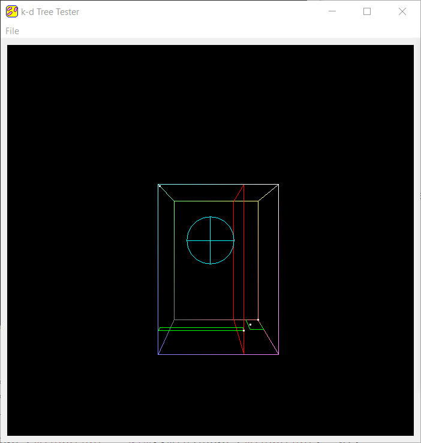

Making a k-d Tree
======================

**University of Pennsylvania, CIS 561: Advanced Computer Graphics, Homework 8**

Wendy Sun (wentings)

Overview
------------
You will implement a k-d tree in a standalone application. Your tree will store
point data and will be used to find all points within a certain radius of some
other point. This will be the basis of the k-d tree you will use in your next
homework assignment: a photon mapper.

Provided code
------
The base code is set up to display a collection of points and a sphere
representing a search radius.

Once you have implemented your k-d tree construction you will be able to
visualize it as well.

Building your k-d tree (60 points)
-----------
In `kdtree.cpp`, fill in the body of the `build` function. This function should
assign values to the `minCorner` and `maxCorner` members of your `KDTree` and
should initialize its `root` member variable. It should also populate `root`'s
children (and their children and so on) using a separate recursive function.
This function's base case should be when a node would be assigned 0 or 1 points
to store, in which case that node should have its `particles` variable assigned
and the function should return. This does mean that only leaf nodes will contain
points, and will contain at most only one point.

Make sure that as you build your k-d tree, you set each node's min and max
boundary attributes, which are necessary for your tree to be properly visualized. You should also tell each node which axis it was split on;
0 means X-axis, 1 means Y-axis, and 2 means Z-axis.

You can test your tree's construction visually by checking the "Display k-d Tree"
box in the GUI (it's checked by default). However, if you try to visualize too
large of a k-d tree (e.g. one containing even as few as 1000 points) you will
likely crash the program as your GPU may not be able to handle all that floating
point data. A k-d tree that large would be too difficult to visually parse
anyway; we recommend visually testing on very small quantities of points (e.g.
4).

k-d Tree Intersection Functions (40 points)
-------
Implement `KDTree::particlesInSphere`, which should construct and return a
`std::vector` containing all the points that fall within the sphere defined by
center point `c` and radius `r`. You should implement functions within the
`KDNode` class to facilitate your search for these points, such as a function to
determine if a sphere overlaps this `KDNode` and if the point(s) contained by
the `KDNode` fall within the sphere.

You can test your implementation by pressing the "Search Points" button,
which will invoke `particlesInSphere` and highlight the points returned in
blue. Make sure your k-d tree has been constructed, otherwise the search will
not be invoked.

Other testing
---------
Once you've completed both halves of this assignment, you should test your
tree construction and point search on large sets of points (on the magnitude
of millions). Construction of a k-d tree on a set of one million points, for
example, should take at most around the order of 10-20 seconds, depending on
your hardware. We've enabled the points that fall within a radius to draw on top
of other points regardless of depth, so you should be able to see what looks
like a solid-ish blue sphere made of points if you radius-test a set of one
million points.

__Remember to disable the visualization of your k-d tree when building it on
large sets of points, or your program will crash!__

Submitting your project
--------------
Along with your project code, make sure that you fill out this `README.md` file
with your name and PennKey.

Rather than uploading a zip file to Canvas, you will simply submit a link to
the committed version of your code you wish us to grade. If you click on the
__Commits__ tab of your repository on Github, you will be brought to a list of
commits you've made. Simply click on the one you wish for us to grade, then copy
and paste the URL of the page into the Canvas submission form.
